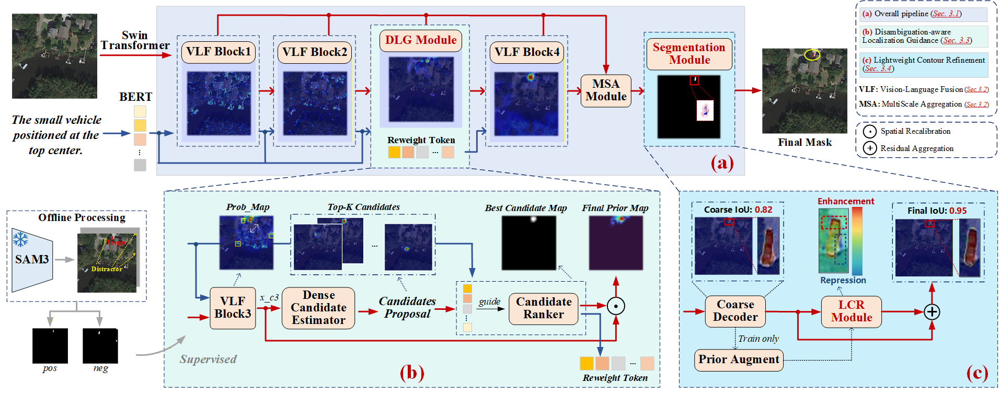

# DiCoR

Official release code for **DiCoR: Decoupled Referent Disambiguation and Contour Recalibration for Efficient Referring Remote Sensing Image Segmentation**.



## Environment

Create a new conda envirenment and install the main dependencies:

```bash
conda create -n dicor python=3.9 -y
conda activate dicor

pip install torch==2.4.0 torchvision==0.19.0 torchaudio==2.4.0 --index-url https://download.pytorch.org/whl/cu121
pip install -r requirements.txt
```

Prepare the initialization files:

```bash
mkdir -p pretrained_weights
```

Download the Swin Transformer classification weight `swin_base_patch4_window12_384_22k.pth` and place it in `pretrained_weights/`.

Download `bert-base-uncased` from Hugging Face and place it under:

```text
bert-base-uncased/
```

## Data

DiCoR supports `risbench`, `rrsisd`, and `refsegrs`.

Please download the three datasets following [RSRefSeg2](https://github.com/KyanChen/RSRefSeg2):

- [RefSegRS](https://github.com/zhu-xlab/rrsis)
- [RRSIS-D](https://github.com/Lsan2401/RMSIN)
- [RISBench](https://github.com/Franpin/Hit-SIRS)

Use the `datainfo` files from RSRefSeg2 and place them in this repository. The examples below use RefSegRS, so set `DATA` to the RefSegRS root and use `DATASET=refsegrs`.

## Training

Set the dataset root and experiment root:

```bash
export DATA=/path/to/RefSegRS
export BANK=checkpoints/refsegrs
```

The coarse baseline is saved to `$BANK/coarse/`, and later stages use `$BANK/coarse/coarse_best.pth`. Refiner and localization-guide training also require a prepared offline PromptBank under:

```text
$BANK/prompt_bank/
  refiner/
    ep*.mmap
  localization/
    ep*.mmap
```

Train the coarse baseline:

```bash
bash scripts/train_coarse.sh
```

Train the contour recalibration refiner:

```bash
bash scripts/train_refiner.sh
```

Train the localization guide:

```bash
bash scripts/train_localization_guide.sh
```

Use environment variables to override defaults, for example:

```bash
DATA=/path/to/RefSegRS DATASET=refsegrs BANK=checkpoints/refsegrs bash scripts/train_coarse.sh
```

## Testing

Evaluate the coarse baseline:

```bash
bash scripts/test_coarse.sh
```

Evaluate full DiCoR:

```bash
bash scripts/test_dicor.sh
```

## Acknowledgements

This codebase is built upon [LAVT-RIS](https://github.com/yz93/LAVT-RIS) and [FIANet](https://github.com/Shaosifan/FIANet). We thank the authors for their excellent open-source work.
