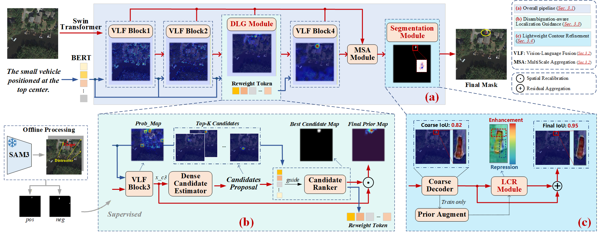

# DiCoR

Official implementation of **DiCoR: Decoupled Referent Disambiguation and Contour Recalibration for Efficient Referring Remote Sensing Image Segmentation**.



## Installation

The code was prepared with Python 3.9, PyTorch 2.4.0, and CUDA 12.1. Create the environment from the repository root:

```bash
conda create -n dicor python=3.9 -y
conda activate dicor

pip install torch==2.4.0 torchvision==0.19.0 torchaudio==2.4.0 \
  --index-url https://download.pytorch.org/whl/cu121
pip install -r requirements.txt
```

Use the PyTorch build matching your local CUDA installation if it differs from CUDA 12.1.

### Initialization weights

Prepare the following files:

```text
DiCoR/
├── pretrained_weights/
│   └── swin_base_patch4_window12_384_22k.pth
└── bert-base-uncased/
    ├── config.json
    ├── pytorch_model.bin
    └── vocab.txt
```

- Download pre-trained Swin transformer checkpoint from [this link](https://github.com/SwinTransformer/storage/releases/download/v1.0.0/swin_base_patch4_window12_384_22k.pth).
- Download the PyTorch files for BERT base uncased from [this link](https://huggingface.co/google-bert/bert-base-uncased) and place them in `bert-base-uncased/` as shown above.

## Data preparation

Download the images for the supported datasets from their official repositories. The data split annotations used by this code are already included under `datainfo/`.

| Dataset | Image directory | Source |
| --- | --- | --- |
| RefSegRS | images/ | [RefSegRS](https://github.com/zhu-xlab/rrsis) |
| RRSIS-D | images/rrsisd/JPEGImages/ | [RRSIS-D](https://github.com/Lsan2401/RMSIN) |
| RISBench | img_rgb/ | [RISBench](https://github.com/Franpin/Hit-SIRS) |

For example:

```text
/path/to/RefSegRS/
└── images/
    └── 1361.tif

/path/to/RRSIS-D/
└── images/rrsisd/JPEGImages/
    └── 02934.jpg

/path/to/RISBench/
└── img_rgb/
    └── train_0_0.png
```

Each annotation is a JSON Lines file. The bundled RRSIS-D and RISBench training annotations also contain the precomputed SAM 3 proposals used to supervise DLG. Since RefSegRS dataset can require multiple valid instances to be segmented jointly, we disable DLG for this dataset and use the coarse segmenter with LCR.

## Training

The training process first runs train_coarse.sh to optimize the coarse vision-language segmenter. Then, train_dicor.sh builds the offline banks and trains the lightweight modules.

### RefSegRS

```bash
export DEVICE=cuda:0
export DATA_ROOT=/path/to/RefSegRS
export OUTPUT_ROOT=checkpoints/refsegrs

bash scripts/refsegrs/train_coarse.sh
bash scripts/refsegrs/train_dicor.sh
```

### RISBench

```bash
export DEVICE=cuda:0
export DATA_ROOT=/path/to/RISBench
export OUTPUT_ROOT=checkpoints/risbench

bash scripts/risbench/train_coarse.sh
bash scripts/risbench/train_dicor.sh
```

### RRSIS-D

```bash
export DEVICE=cuda:0
export DATA_ROOT=/path/to/RRSIS-D
export OUTPUT_ROOT=checkpoints/rrsisd

bash scripts/rrsisd/train_coarse.sh
bash scripts/rrsisd/train_dicor.sh
```

## Evaluation

### RefSegRS

```bash
DEVICE=cuda:0 \
DATA_ROOT=/path/to/RefSegRS \
OUTPUT_ROOT=checkpoints/refsegrs \
bash scripts/refsegrs/test.sh
```

### RISBench

```bash
DEVICE=cuda:0 \
DATA_ROOT=/path/to/RISBench \
OUTPUT_ROOT=checkpoints/risbench \
bash scripts/risbench/test.sh
```

### RRSIS-D

```bash
DEVICE=cuda:0 \
DATA_ROOT=/path/to/RRSIS-D \
OUTPUT_ROOT=checkpoints/rrsisd \
bash scripts/rrsisd/test.sh
```

## License

This project is released under the [GNU General Public License v3.0](LICENSE).

## Acknowledgements

This codebase is built upon [LAVT-RIS](https://github.com/yz93/LAVT-RIS) and [FIANet](https://github.com/Shaosifan/FIANet). We thank the authors for their excellent open-source work.
